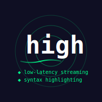

# high



A minimalistic, terminal-based interface for Large Language Models (LLMs) designed for **low-latency feedback**.

## Motivation

**Why Vibe Coding Fails - Ilya Sutskever**

[](https://www.youtube.com/watch?v=aIvHf8vsWBM)

The major limitation of the current LLMs is the introduction of new bugs in the attempt to fix the target one(s).  The only possible way out of it is to closely monitor what the LLM is doing, how does it thinking, what problems it might report *(a missing source code header? or a specification file? or a tool-call declaration?)* and in case if any problem appears, one could just do `Ctrl + C` and continue the conversation by typing `high -C "clarifications..."`.  Moreover, if one deals with a lot of code in the output of LLM the syntax highlighting simultaneously with streaming support are required. etc.

Most TUI LLM suites today are implemented extremely inefficiently. For example, [`charmbracelet/mods`](https://github.com/charmbracelet/mods/issues/635) can delay final output by a minute or so (for a regular 10k ctx). [`Claude Code` supports max 60 FPS](https://www.youtube.com/watch?v=LvW1HTSLPEk).

`high` solves this with **Preview Mode**. It streams raw tokens immediately as "ghost text" so one can read the output as it generates, then seamlessly swaps in the syntax-highlighted version the moment the line completes.

For example,

```bash
time high -m Qwen3.5-397B-A17B-IQ2_KL -f -p --md "output a mandelbrot in colour into tui via awk /bash"
```


```bash
# The gif is obtained via:
# 
#ttyrec -e 'time high -m Qwen3.5-397B-A17B-IQ2_KL -f -p --md "output a mandelbrot in colour into tui via awk /bash"'
#ttygif ttyrecord
#gifsicle -O9 ./tty.gif -o tty.compressed.gif
```

This approach offers the control of real-time streaming with the polish of syntax highlighting, without the overhead of heavy TUI frameworks. The tool is basically a highly optimized clone of `mods` where all syntax highlighting work is delegated to `highlight` and all conversations are kept in `json`.

## Installation

### Build Dependencies

*   **Compiler**: `g++` or `clang` (C++20 support required).
*   **Libraries**: `libcurl`, `libjansson`.

### Runtime Dependencies

*   **`highlight`**: Optional. If installed, `high` uses it for syntax highlighting. If missing, code blocks display as plain text.
*   **`xclip`**: Optional. If installed, the ID of the selected conversation will be copied into the clipboard.
*   **`fzf`**: Required for `cb` utility (codeblock extractor).
*   **`bat`** or **`batcat`**: Optional. Used by `cb` for enhanced codeblock preview.

## Setup

```bash
sudo apt install g++ build-essential libcurl4-openssl-dev libjansson-dev
sudo apt install highlight xclip bat fzf gawk
# 
make
sudo make install
# Use syntax highlighting with ghost text and markdown highlighting by default
high --format --preview --md --config-dump | tee -a ~/.bashrc
source ~/.bashrc
# Install extra utilities (pre, cb)
sudo make install-extras
```

## Features

- **Zero-latency Streaming**: Preview mode displays tokens immediately with ghost text, swapping in highlighted versions on completion
- **Smart Syntax Highlighting**: Automatic language detection with fallback to markdown formatting (`-f`, `--md`)
- **Conversation Management**: Save, load, branch, and resume conversations with automatic timestamped titles
- **Interactive Selection**: TUI interface for browsing conversation history with vim-style keybindings (`-l`)
- **Flexible Output Modes**: Raw JSON (`-r`), plain text (`-F`), or formatted markdown
- **Universal Piping**: Reads from stdin and writes to stdout; integrates seamlessly into Unix pipelines
- **Extra Utilities**: `pre` for file context injection, `cb` for interactive codeblock extraction

## Usage

### Highlighting with streaming (`--format --preview --md`)

The highlighting (both for codeblocks and the rest of the output) is enabled by default.
The `--preview` mode is optional, but essential especially for slower models (~20 tps decode).

1.  **Immediate Feedback**: As the LLM emits tokens, they appear instantly in a dimmed color (ghost text).
2.  **Automatic Highlighting**: When a code line completes, `high` passes it to the `highlight` binary and replaces the ghost text with the fully colored version.

#### The Flow

`high` reads from `stdin` and writes to `stdout`. It fits naturally into Unix pipelines.

```bash
curl -s https://github.com/ikawrakow/ik_llama.cpp/issues/629 | html2text | high -m Qwen-3.5 "what is the best hardware for the llm inference?"
```

### Conversation management

```bash
high --models
> Kimi-K2.5-GGUF_IQ3_K
> Qwen3.5-397B-A17B-IQ2_KL
> Qwen3.5-397B-A17B-IQ4_KSS

# Ask Kimi-K2.5 to make a script
high -m Kimi-K2.5 "write a script for a full system backup into the .tar.gz archive"

# View the last conversation
high -S

# Continue the last conversation with a different LLM
high -C -m Qwen3.5 "dump it to a file and execute via bash /bash"
# Any time you can interrupt the conversation and add more context
# `Ctrl + C` -> `y`
cat ~/credentials.txt | high -C "use these to upload to the remote server"

# Branch conversation (save as new instead of continuing existing)
high -C -i -m Qwen3.5 "try a different approach"  # Creates new conversation branched from last

# System prompt manipulations etc.
high -m Qwen3.5 -R "you are professional system architect with 50y experience" "can you write a comprehensive chess engine with AI and a polished tui in c?"
```

### History management

```bash
# Select a conversation from history (interactive TUI)
# (If xclip is installed also copies the id of the selected
# conversation into be clipboard)
high --list

# Alternatively, the non-interactive mode:
high --list | head -n 72 | tail 
> conv_1772224588366 (2026-02-28 10:27) [Qwen3.5-397B-A17B-IQ2_KL]
> conv_1772225893755 (2026-02-27 22:58) [Kimi-K2.5-GGUF_IQ3_K] [Interrupted]
> conv_1772224513458 (2026-02-27 22:35) [Qwen3.5-397B-A17B-IQ2_KL]
> conv_1772220106336 (2026-02-27 21:55) [Qwen3.5-397B-A17B-IQ4_KSS]
> conv_1772219943271 (2026-02-27 21:47) [Qwen3.5-397B-A17B-IQ2_KL]
> conv_1772221157687 (2026-02-27 21:39) [Kimi-K2.5-GGUF_IQ3_K]
> conv_1772219392149 (2026-02-27 21:09) [Kimi-K2.5-GGUF_IQ3_K] [Interrupted]
> conv_1772216271607 (2026-02-27 20:43) [Qwen3.5-397B-A17B-IQ4_KSS]
> conv_1772216654829 (2026-02-27 20:39) [Qwen3.5-397B-A17B-IQ2_KL]
> conv_1772217147864 (2026-02-27 20:32) [Kimi-K2.5-GGUF_IQ3_K] [Interrupted]

# Display the target conversation
high -s conv_1772224588366

# Plain text output for piping
high-plain -s conv_1771897941504 | less

# Extract user messages from raw JSON
high -s conv_1771897941504 --raw | jq -r '.messages[] | select(.role == "user") | .content' | grep --colour hello
```

### Conversation Modes

| Flag | Behavior |
|------|----------|
| `-c TITLE` | Continue from saved conversation `TITLE`, append to same file |
| `-C` | Continue from last conversation, append to same file |
| `-c TITLE -i` | Branch from `TITLE`, save as NEW conversation |
| `-C -i` | Branch from last conversation, save as NEW conversation |
| (none) | Start fresh conversation with auto-generated title |

## Extra Utilities

After running `sudo make install-extras`, two additional utilities are available:

### `pre` - File Context Provider

Injects file contents with proper markdown codeblocks into LLM prompts.

**Features:**
- Automatic language detection based on file extension
- Recursive directory scanning (maxdepth 2)
- Proper trailing newline handling
- Full path resolution

**Usage:**
```bash
# Single file
pre src/main.cpp | high "Review this code"

# Directory search
pre ./src "*.py" | high "Find all Python files and explain their purpose"

# Multiple files
pre src/*.*pp include/*.h | high "Analyze the architecture"

# Combine with conversation
pre docs/api.md | high -C "Update the documentation based on these changes"
```

**Supported Extensions:**
`sh, bash, zsh, py, js, ts, rb, go, rs, c, cc, cpp, h, hpp, java, cs, php, html, htm, css, json, xml, yaml, yml, md, sql`

### `cb` - Interactive Codeblock Extractor

Extracts codeblocks from `high` output (or any markdown source) with interactive selection.

**Features:**
- Parses markdown codeblocks (```lang ... ```)
- Interactive TUI with fzf
- Preview with syntax highlighting (requires `bat`/`batcat`)
- Automatic clipboard copy (requires `xclip`)
- Shows block metadata (ID, line number, line count, language)

**Usage:**
```bash
# Extract codeblocks from conversation
high -S -F | cb
```

**Output:**
- Selected codeblock copied to clipboard (with xclip)
- Metadata displayed: block ID, language, line count
- Falls back to stdout if not in TTY mode

**Dependencies:**
- Required: `fzf`, `awk`
- Optional: `bat`/`batcat` (enhanced preview), `xclip` (clipboard copy)

### Installing Extras

```bash
# Install to /usr/local/share/high and create aliases in /usr/local/bin
sudo make install-extras

# Verify installation
which pre
which cb

# Uninstall extras
sudo make uninstall-extras
```

### Adding to PATH

Add to `~/.bashrc` or `~/.zshrc`:
```bash
export PATH="/usr/local/bin:$PATH"
```

## Environment Variables

| Variable | Description | Default |
|----------|-------------|---------|
| `LLM_API_BASE` | API endpoint URL | `http://localhost:8042/v1` |
| `LLM_CONFIG_DIR` | Configuration directory | `~/.config/high` |
| `LLM_SYSTEM_ROLE` | Default system prompt | `You are a helpful assistant.` |
| `LLM_MAX_TOKENS` | Maximum tokens for response | `0` (unlimited) |
| `LLM_TEMPERATURE` | Sampling temperature | `1.0` |
| `LLM_TIMEOUT` | Request timeout in seconds | `36000` |
| `LLM_FORMAT_MARKDOWN` | Enable markdown formatting | `1` |
| `LLM_VERBOSE` | Verbose output | `0` |
| `HIGHLIGHT_THEME` | Syntax highlighting theme | `xoria256` |
| `HIGH_PREVIEW_CODE` | Enable code preview mode | `0` |
| `HIGH_MARKDOWN_SYNTAX` | Enable markdown highlighting | `1` |
| `LLM_TAB_WIDTH` | Tab expansion width | `8` |
| `HTTP_PROXY` | HTTP proxy URL | (none) |

## Examples

```bash
# Basic usage
high "What is the capital of France?"

# With specific model
high -m llama-3 "Explain quantum computing"

# Continue last conversation
high -C "Add more details about..."

# Branch from last conversation (create new)
high -C -i "Try a different approach"

# List conversations
high -l

# Show conversation with full highlighting and a ghost-text
high -s myconv -f -p --md

# Pipe from curl
curl -s https://example.com/api | high "Summarize this"

# Export configuration
high --config-dump >> ~/.bashrc

# Debug log
high -S -f -p --md --debug --log-file high_debug.log

# Use with pre utility
pre src/*.cpp | high "Review this code for security issues"

# Extract codeblocks from conversation
high-plain -S | cb

# List and apply the specific highlight theme
highlight --list-scripts=themes | grep -F ': vim'
high --theme bluegreen -S -f -p --md

# "Feature: chat start-new should return or display new chat ID"
# https://github.com/charmbracelet/mods/issues/675
# 
NEW_ID=$(high -m Qwen3.5 "hello" 2>/dev/stdout | grep -Eo 'conv_[0-9]+' | tail -n1)
pre file.txt | high -c "$NEW_ID" --isolate "Message"
```

## Files

| Path | Description |
|------|-------------|
| `~/.config/high/conversations/` | Directory containing saved conversations (JSON format) |
| `/usr/local/share/high/` | Extra utilities (pre, cb) |
| `/usr/local/bin/pre` | Alias script for pre utility |
| `/usr/local/bin/cb` | Alias script for cb utility |

## Troubleshooting

### No syntax highlighting
- Ensure `highlight` is installed: `sudo apt install highlight`
- Check theme availability: `highlight --list-scripts=themes`
- Use `--theme` to specify different theme

### Conversation not saving
- Check permissions: `ls -la ~/.config/high/conversations/`
- Verify disk space
- Check for JSON parse errors in logs

### Extras not working
- Verify installation: `sudo make install-extras`
- Check PATH: `echo $PATH`
- Verify dependencies: `which fzf`, `which batcat`

## See Also

- [`curl(1)`](https://packages.debian.org/testing/curl) - HTTP client
- [`highlight(1)`](https://packages.debian.org/testing/highlight) - Syntax highlighting
- [`jq(1)`](https://packages.debian.org/testing/jq) - JSON processor
- [`fzf(1)`](https://packages.debian.org/testing/fzf) - Fuzzy finder
- [`bat(1)`](https://packages.debian.org/testing/bat) - Cat with syntax highlighting

## Bugs

Report bugs at: https://github.com/magikRUKKOLA/high/issues

## Author

magikRUKKOLA <magikRUKKOLA@proton.me>

## License

GPL-3.0
